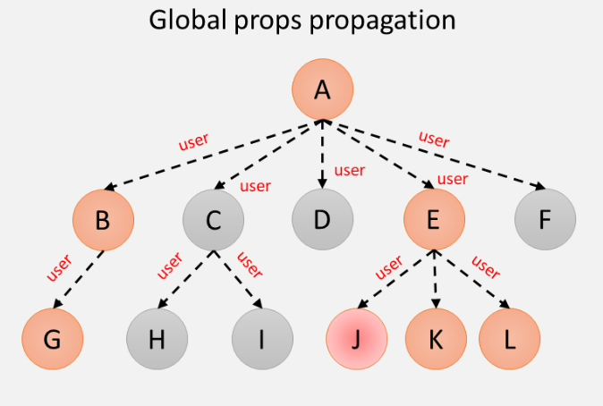

# Contex API

Context provides a way to pass data through the component tree without having to manually pass props at each level.
Context is designed to share data that can be considered "global" for a component tree in React, such as the current authenticated user, theme or preferred language.
If you work with different views they will not be nested, so Context provides a solution.

## Redux vs Context

Redux provides a complete set of tools to manage the state:
It comes with a time-traveling debugger.
It provides a middleware API that gives you access to tools like redux-sagas.
Its React bindings avoid a lot of unnecessary rendering.
As you can see, context does not replace Redux. Context will not allow you to time travel with debugging, configurable middleware.

Context is a way to get data from one place to another. If you want a tool to help you manage your state, Redux is an excellent choice.

[context api](https://www.itdo.com/blog/react-context-api-puede-ser-alternativa-a-redux/)

[when-context-replaces-redux](https://frontarm.com/james-k-nelson/when-context-replaces-redux/)

## CreateContext
