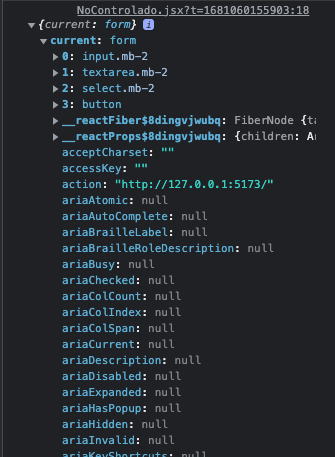
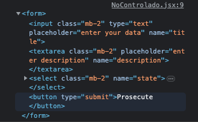
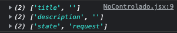
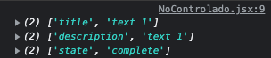
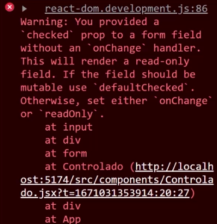

# React Hooks Formularios

## Planning

- Uncontrolled forms
- Controlled forms

- uncontrolled: In most cases, we recommend using Controlled Components to implement forms.
- In a controlled component, the form data is handled by a React component.
- The alternative is uncontrolled components, where the form data is handled by the DOM itself.
- To write an uncontrolled component, you can use a reference to get the form values from the DOM.

we have the base form

```jsx
import React from "react";

const NoControlado = () => {
  const handleSubmit = (first) => {
    console.log("click on me");
  };

  return (
    <form onSubmit={handleSubmit} action="">
      <input
        className="mb-2"
        type="text"
        placeholder="enter your data"
        name="title"
      />
      <textarea
        className="mb-2"
        placeholder="enter description"
        name="description"
      ></textarea>
      <select className="mb-2" name="state">
        <option value="request">request</option>
        <option value="complete">complete</option>
      </select>
      <button type="submit">Prosecute</button>
    </form>
  );
};

export default NoControlado;
```

we can se the url

```bash
http://127.0.0.1:5173/?title=pregunta&description=text&state=complete
```

with the name an value of our form, this is how the form is processed in HTML.
The browser try to send through the action method

```jsx
return (
  <form onSubmit={handleSubmit} action="">
    <input
      className="mb-2"
      type="text"
      placeholder="enter your data"
      name="title"
    />
    <textarea
      className="mb-2"
      placeholder="enter description"
      name="description"
    ></textarea>
    <select className="mb-2" name="state">
      <option value="request">request</option>
      <option value="complete">complete</option>
    </select>
    <button type="submit">Prosecute</button>
  </form>
);
```

with this avoid the behavior by default of the browser

```jsx
import React from "react";

const NoControlado = () => {
  const handleSubmit = (e) => {
    e.preventDefault();
    console.log("click on me");
  };

  return (
    <form onSubmit={handleSubmit}>
      <input
        className="mb-2"
        type="text"
        placeholder="enter your data"
        name="title"
      />
      <textarea
        className="mb-2"
        placeholder="enter description"
        name="description"
      ></textarea>
      <select className="mb-2" name="state">
        <option value="request">request</option>
        <option value="complete">complete</option>
      </select>
      <button type="submit">Prosecute</button>
    </form>
  );
};

export default NoControlado;
```

Let´s to know other event sayed onSubmit this always is controled for react
"onSubmit"

## useRef

When create our reference not yet rendering our form

```jsx
const form = useRef(null);
```

here we manipulate the DOM through the virtual DOM which is done by react.

We have the property current and inside we have the form. This form is each one
of our fields





## formData()

```jsx
const handleSubmit = (e) => {
  e.preventDefault();
  console.log(form.current);
  console.log(new FormData(form.current));
};
```

let´s click on process inside we have a prototype inside the prototype have many attributes, the property that that we are interested in

> entries

this entries in some way we have to go through them, because they are different fields.

let´s ocuppy spread operator of entries

```jsx
const handleSubmit = (e) => {
  e.preventDefault();
  const data = new FormData(form.current);
  console.log(...data.entries());
};
```



this correpond each one our names.
right now if we fill in each of the forms, can see the value



we can apply the default value inside our input, is important pass the attribute name.
spread operator: allows an iterable element to be expanded
copy each of its elements

```jsx
const dataObject = object.fromEntries([...data.entries()]);
```

we can destructuring direct the value that we need

```jsx
import React, { useRef } from "react";

const NoControlado = () => {
  const form = useRef(null);

  const handleSubmit = (e) => {
    e.preventDefault();
    const data = new FormData(form.current);

    const { title, description, state } = Object.fromEntries([
      ...data.entries(),
    ]);
    console.log(title, description, state);
  };

  return (
    <form onSubmit={handleSubmit} ref={form}>
      <input
        className="mb-2"
        type="text"
        placeholder="enter your data"
        name="title"
        defaultValue="todo #01"
      />
      <textarea
        className="mb-2"
        placeholder="enter description"
        name="description"
        defaultValue="description #01"
      ></textarea>
      <select className="mb-2" name="state" defaultValue="complete">
        <option value="request">request</option>
        <option value="complete">complete</option>
      </select>
      <button type="submit">Prosecute</button>
    </form>
  );
};

export default NoControlado;
```

is a process more length, remember that we are working with form no controlled

## Validate the data

```jsx
//validate the data
if (title.trim() === "") return console.log("llena este campo");

if (!title.trim()) return console.log("llena este campo");
```

is the same.
We are controled this form once the client processes this form.

each time that process the form, I clean it for viewing if are errors

```jsx
import React, { useRef, useState } from "react";

const NoControled = () => {
  const [error, setError] = useState("");
  const form = useRef(null);

  const handleSubmit = (e) => {
    e.preventDefault();
    setError("");
    //catch the data
    const data = new FormData(form.current);

    const { title, description, state } = Object.fromEntries([
      ...data.entries(),
    ]);
    //validate the data
    if (!title.trim() || !description.trim() || !state.trim())
      return setError("fill the fields");

    console.log(title, description, state);
    //send the data
  };

  return (
    <form onSubmit={handleSubmit} ref={form}>
      <input
        className="mb-2"
        type="text"
        placeholder="enter your data"
        name="title"
        defaultValue="todo #01"
      />
      <textarea
        className="mb-2"
        placeholder="enter description"
        name="description"
        defaultValue="description #01"
      ></textarea>
      <select className="mb-2" name="state" defaultValue="complete">
        <option value="request">request</option>
        <option value="complete">complete</option>
      </select>
      <button type="submit">Prosecute</button>
      {error !== "" && error}
    </form>
  );
};

export default NoControled;
```

## Form controled

For now, let's create a state for each of our states

```jsx
const [title, setTitle] = useState("");
const [description, setDescription] = useState("");
const [state, setState] = useState("pending");
```

we have to do the association with each one of the inputs.
With the value we indicated it each one of states corresponding.
Let´s to save, we have a error. warning say:
you privided a value prop to a form field without an onChange.

The idea is each time I write on input is related to setTitle, remember that this setTitle do that is modified the state.
How we use this setTile the console give us the error is use oneChange

How we use this setTile the console give us the error to use oneChange, this onChange you pass like atributo, is other event that has React.
Similar how we to use onSubmit, always we can catch the event and use setTitle

```jsx
import React, { useState } from "react";

const Controled = () => {
  const [title, setTitle] = useState("Todo #01");
  const [description, setDescription] = useState("Description #01");
  const [state, setState] = useState("pending");

  const handleSubmit = (e) => {
    e.preventDefault();
    console.log(title, description, state);
  };

  return (
    <form onSubmit={handleSubmit}>
      <input
        className="mb-2"
        type="text"
        placeholder="enter your data"
        name="title"
        value={title}
        onChange={(e) => setTitle(e.target.value)}
      />
      <textarea
        className="mb-2"
        placeholder="enter description"
        name="description"
        value={description}
        onChange={(e) => setDescription(e.target.value)}
      ></textarea>
      <select
        className="mb-2"
        name="state"
        value={state}
        onChange={(e) => setState(e.target.value)}
      >
        <option value="request">request</option>
        <option value="complete">complete</option>
      </select>
      <button type="submit">Prosecute</button>
    </form>
  );
};

export default Controled;
```

## Avoid use to much useState

Let´s initialize only one state, the state it will be an object

```jsx
const [todo, setTodo] = useState({
  title: "Todo #01",
  description: "Description #01",
  state: "pending",
});
```

if we save up to this point we will break the code, because no exist yet
title, description and state, in fact we are using setTitle which doesn't exist yet.

- 1 first let´s to use setTodo

```jsx
<input
  className="mb-2"
  type="text"
  placeholder="enter your data"
  name="title"
  value={title}
  onChange={(e) => setTodo({ ...todo, title: e.target.value })}
/>
```

with this copy we make sure that the current state is still maintained, because I need the copy if the client writes in the text area or selects some other option in the selects. this is for avoiding each one states.

The only difference is that initialize our useState like an object

## explanation spread operator

```jsx
const Cat = () => {
  const [cat, setCat] = useState({
    name: "Felix",
    year: 3,
  });

  const hancleClick = () => {
    // setCat({ ...cat, year: cat.year + 1 });
    setCat((prev) => ({ ...prev, year: cat.year + 1 }));
  };

  return (
    <>
      <h2>
        {cat.name} - {cat.year}
      </h2>
      <button onClick={hancleClick}>update year</button>
      <hr />
    </>
  );
};

export default Cat;
```

both way are correct:

- 1 we pass to setState the spread operator with the previous data of the state plus the update of the property
- 2 pass a fnction with the data previus, this must return the new value of the state
  callback function

```jsx
const hancleClick = () => {
  // setCat({ ...cat, year: cat.year + 1 });
  setCat((prev) => ({ ...prev, year: cat.year + 1 }));
};
```

## Reuse onChange

I want to reuse is the onChange this logic is the same in each of the input, only change the property
name, decription and state.

we have saved a lot of code, reusing the onChange and using the technique of the square brackets as property name in objects

```jsx
import React, { useState } from "react";

const Controled = () => {
  const [todo, setTodo] = useState({
    title: "Todo #01",
    description: "Description #01",
    state: "pending",
  });

  const handleSubmit = (e) => {
    e.preventDefault();
    console.log(todo.title, todo.description, todo.state);
  };

  const handleChange = (e) => {
    // console.log((e.target.name, e.target.value));

    setTodo({
      ...todo,
      [e.target.name]: e.target.value,
    });
  };

  return (
    <form onSubmit={handleSubmit}>
      <input
        className="mb-2"
        type="text"
        placeholder="enter your data"
        name="title"
        value={todo.title}
        onChange={handleChange}
      />
      <textarea
        className="mb-2"
        placeholder="enter description"
        name="description"
        value={todo.description}
        onChange={handleChange}
      ></textarea>
      <select
        className="mb-2"
        name="state"
        value={todo.state}
        onChange={handleChange}
      >
        <option value="request">request</option>
        <option value="complete">complete</option>
      </select>
      <button type="submit">Prosecute</button>
    </form>
  );
};

export default Controled;
```

## Checkbox

```jsx
<div>
  <input
    type="checkbox"
    name="priority"
    className="form-input"
    id="inputCheck"
  />
  <label htmlFor="inputCheck">Prioritize</label>
</div>
```

Let's add an attribute checked in the input of kind checkbox. What name we add to the input
we put a priority, this must be added inside useState

```jsx
const [todo, setTodo] = useState({
  title: "Todo #01",
  description: "Description #01",
  state: "pending",
  priority: true,
});
```

we see pass nothing, we must add a property that is not a value, it's checked

```jsx
<div>
  <input
    type="checkbox"
    name="priority"
    className="form-input"
    id="inputCheck"
    checked={todo.priority}
  />
  <label htmlFor="inputCheck">Prioritize</label>
</div>
```

is this field is selected should recibes true or false, then let´s set the property
onChange, because in console show this error



when put value in each field it said to us that it was missing onChange.
indeed we have the relation with our inputs with our state.

## oneChange checkbox

```jsx
const handleChange = (e) => {
  // console.log((e.target.name, e.target.value));
  //onChange={(e) => setTodo({ ...todo, priority: e.target.checked })}
  setTodo({
    ...todo,
    [e.target.name]:
      e.target.type === "checkbox" ? e.target.checked : e.target.value,
  });
};
```

when it arrives to us, this kind of field "checkbox" we can to pass the value of check
when isn't of kind checkbox continue used value

```jsx
import React, { useState } from "react";

const Controled = () => {
  const [todo, setTodo] = useState({
    title: "Todo #01",
    description: "Description #01",
    state: "pending",
    priority: false,
  });
  const [error, setError] = useState(false);

  const handleSubmit = (e) => {
    e.preventDefault();
    const { title, description } = todo;
    // console.log(title, description, state, priority);

    // small validation
    if (!title.trim() || !description.trim()) {
      console.log("campos vacíos");
      setError(true);
      return;
    } else {
      setError(false);
    }
  };

  const handleChange = (e) => {
    // console.log((e.target.name, e.target.value));
    const { name, value, checked, type } = e.target;

    setTodo((prev) => ({
      ...prev,
      [name]: type === "checkbox" ? checked : value,
    }));
  };

  const PrintError = () => (
    <div className="alert alert-danger">Todos los campos obligatorios</div>
  );

  return (
    <form onSubmit={handleSubmit}>
      {error && <PrintError />}
      <input
        className="mb-2"
        type="text"
        placeholder="enter your data"
        name="title"
        value={todo.title}
        onChange={handleChange}
      />
      <textarea
        className="mb-2"
        placeholder="enter description"
        name="description"
        value={todo.description}
        onChange={handleChange}
      ></textarea>
      <div className="form-check">
        <input
          className="form-check-input"
          type="checkbox"
          id="inputCheck"
          checked={todo.priority}
          onChange={handleChange}
          name="priority"
        />
        <label className="form-check-label" htmlFor="inputCheck">
          Prioritize
        </label>
      </div>
      <select
        className="mb-2"
        name="state"
        value={todo.state}
        onChange={handleChange}
      >
        <option value="request">request</option>
        <option value="complete">complete</option>
      </select>
      <button type="submit">Prosecute</button>
    </form>
  );
};

export default Controled;
```

- 1 create new state for manage the error
- let´s destructuring of todo for a small validation
- finally destructuring of e.target for the kind o checkbox
  the code is more readable

## Practice Form CRUD

We leave out the initial state, this is advisable because each time we render our
component, in order not to create this constant each time, we leave it out the initial state.

Let´s to create an array of object

```jsx
import { useState } from "react";
import Form from "./components/Form";

const initialState = [
  {
    id: 1,
    title: "Todo #01",
    description: "Description #01",
    state: true,
    priority: false,
  },
  {
    id: 2,
    title: "Todo #02",
    description: "Description #02",
    state: false,
    priority: false,
  },
  {
    id: 3,
    title: "Todo #03",
    description: "Description #03",
    state: false,
    priority: true,
  },
];

function App() {
  const [todo, setTodo] = useState([]);
  return (
    <div className="container">
      <h1>hi react app + vite!</h1>

      <Form />
    </div>
  );
}

export default App;
```

this initialState is replaced for the array, this way we can visualize the scheme of the elements.

```jsx
const initialState = [
  {
    id: 1,
    title: "Todo #01",
    description: "Description #01",
    state: true,
    priority: false,
  },
  {
    id: 2,
    title: "Todo #02",
    description: "Description #02",
    state: false,
    priority: false,
  },
  {
    id: 3,
    title: "Todo #03",
    description: "Description #03",
    state: false,
    priority: true,
  },
];

function App() {
  const [todos, setTodo] = useState(initialState);
  return (
    <div className="container">
      <h1>hi react app + vite! Form</h1>

      <Form />
      <Todos todos={todos} />
    </div>
  );
}

export default App;
```

Let's create Todos component then pass the props todos, so we can iterate.

Let's show an alert if the user leaves some field empty, we need validate title and description.

Each time that leave title and description empty, the app show me an alert with the message:
Title and description are mandatory!

pass addTodo props for form component, remember that must recive a todo

```jsx
const addTodo = (todo) => {
  setTodo(...todos, todo);
};
```

the form recive this via props, each time that user press click musted add a new todo, but I going to
create

## Read todo

Let´s pass todo like a props

```jsx
import React from "react";
import Todo from "./Todo";

const Todos = ({ todos }) => {
  return (
    <>
      <h2 className="text-center">
        Todos{" "}
        <span role="img" aria-label="todo">
          📚
        </span>
      </h2>
      <ul>
        {todos.map((todo) => (
          <Todo key={todo.id} todo={todo} />
        ))}
      </ul>
    </>
  );
};

export default Todos;
```

then let´s to receive the prop and we destructuring the data that need

```jsx
const Todo = ({ todo }) => {
  const { title, description, state, priority } = todo;

  return (
    <li className="todo d-flex justify-content-between align-items-start p-2 mb-1 ">
      <div>
        <h5 className={`${state && "text-decoration-line-through"}`}>
          {title}
        </h5>
        <p>{description}</p>
        <div className="d-flex gap-2">
          <button className="btn btn-sm btn-danger">Delete</button>
          <button className="btn btn-sm btn-info">Update</button>
        </div>
      </div>
      <span className="badge bg-primary rounden-pill">
        {priority && "Priority"}
      </span>
    </li>
  );
};

export default Todo;
```

We have our component todo check with all data necessary for showing to user

## delete Todo

let´s create our function deleteTodo then pass for props

```jsx
const deleteTodo = (id) => {
  const newArray = todos.filter((todo) => todo.id !== id);
  setTodo(newArray);
};
```

```jsx
<Todos todos={todos} deleteTodo={deleteTodo} />
```

```jsx
import React from "react";
import Todo from "./Todo";

const Todos = ({ todos, deleteTodo }) => {
  return (
    <>
      <h2 className="text-center">
        Todos{" "}
        <span role="img" aria-label="todo">
          📚
        </span>
      </h2>
      <ul>
        {todos.map((todo) => (
          <Todo key={todo.id} todo={todo} deleteTodo={deleteTodo} />
        ))}
        {todos.length === 0 && (
          <li className="list-gruop-item text-center">without Todo!</li>
        )}
      </ul>
    </>
  );
};

export default Todos;
```

let´s pass a callback because don´t wanted the execution inmediently of this function

```jsx
const Todo = ({ todo, deleteTodo }) => {
  const { title, description, state, priority, id } = todo;

  return (
    <li className="todo d-flex justify-content-between align-items-start p-2 mb-1">
      <div>
        <h5 className={`${state && "text-decoration-line-through"}`}>
          {title}
        </h5>
        <p className={`${state && "text-decoration-line-through"}`}>
          {description}
        </p>
        <div className="d-flex gap-2">
          <button
            onClick={() => deleteTodo(id)}
            className="btn btn-sm btn-danger"
          >
            Delete
          </button>
          <button className="btn btn-sm btn-info">Update</button>
        </div>
      </div>
      <span className="badge bg-primary rounden-pill">
        {priority && "Priority"}
      </span>
    </li>
  );
};

export default Todo;
```
