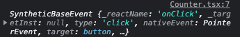
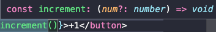
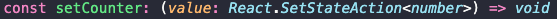

# react + TS

In Typescript if apply :void the means, is that not return anything

```tsx
const increment = (): void => {
  setCounter(counter + 1);
};
```

```tsx
const increment = (number): void => {
  setCounter(counter + 1);
};
```

TS show us this message Parameter 'number' implicitly has an 'any' type.

```json
"strict": true,
```

in the .json file we have strict as true, the strict mode tells typescript that we should always have a type

here typescript show me an error

```tsx
import { useState } from "react";

const Counter = () => {
  const [counter, setCounter] = useState(0);

  const increment = (num: number): void => {
    setCounter(counter + 1);
  };

  return (
    <div style={{ marginTop: "16px" }}>
      <h2>Counter: useState</h2>
      <span>valor: {counter}</span>
      <br />
      <button onClick={increment}>+1</button>
    </div>
  );
};

export default Counter;
```

```tsx
const increment = (ev: any): void => {
  console.log(any);
};
```

with any I can tell it what number is going to be anything

it was an event that we received, not a number or a plus 1



note that this question mark is optional



```tsx
const increment = (num: number = 1): void => {
  setCounter(counter + num);
};
```

Type number trivially inferred from a number literal, remove type annotation.

delete -> number in this case



setCounter is the type number, this means that what is between curly brackets is a number, in genneral TS this <> it means that is of generic type, any type of data can be set manually.

let´s continue with another component User, let´s see a different example.

```bash
const user: undefined
```

# User Component

```jsx
import { useState } from "react";

const User = () => {
  const [user, setUser] = useState();

  const login = () => {
    setUser({
      uid: "abc123",
      name: " Kyo",
    });
  };

  return (
    <>
      <h2>User: useState</h2>
      <button>click</button>
    </>
  );
};

export default User;
```

We have saw that typescript mark an error, because I´m assign undefines to useState.

I need to establish in the login the information of the user, here it is already convenient to work with classes or interfaces to put the typing, interface is compiled and it is equal to zero lines of code.

Internally, to the useState we are going to say to him that it handles a user.

this Hook the useState going to manage an User, and the value of the setState is perfectly valid, besides I can set it to a default value

in this case we would have to have the seconds as a dependency, this is going to generate a conflict, because every time I change second it is going to fire again useEffect, every time it is going to create a lot of time intervals and this is not going to be seen, as we are expecting, because every second is creating new intervals. In theory, we would not use the second dependency.

if we establish a callback inside the function that we have in useState.

- The first value that this one admits is the value of state

- if I leave the cursor over it says the current value

What we can do with useEffect is to execute an instruction when the component is going to be destroyed

```tsx
import { useEffect, useState } from "react";

const Timer = () => {
  const [seconds, setSeconds] = useState(0);

  useEffect(() => {
    setInterval(() => setSeconds((s) => s + 1), 1000);
  }, []);

  return (
    <h3>
      Timer: <small>{seconds}</small>
    </h3>
  );
};

export default Timer;
```

let's suppose I need to receive an argument from the parent, this argument contains milliseconds that we have to set here

```tsx
setInterval(() => setSeconds((s) => s + 1), 1000);
```

right now let`s see an error in the props of the component

```tsx
<Timer miliseconds={miliseconds} />
```

Type '{ miliseconds: number; }' is not assignable to type 'IntrinsicAttributes'.
Property 'miliseconds' does not exist on type 'IntrinsicAttributes'.

Error (TS2322) |
Type
is not assignable to type
.

Property miliseconds does not exist on type
.
(property) miliseconds: number

this code is valid how we can say to typescript, hey let's have a property that it's called milliseconds if I write console.log(args.) Typescripts don't know what information receives

we can put an type TimerArgs, this a type that only I´m going to work in this file

```tsx
import { useEffect, useState } from "react";

type TimerArgs = {
  miliseconds: number;
};

const Timer = (args: any) => {
  const [seconds, setSeconds] = useState(0);

  console.log(args);

  useEffect(() => {
    setInterval(() => setSeconds((s) => s + 1), 1000);
  }, []);

  return (
    <h3>
      Timer: <small>{seconds}</small>
    </h3>
  );
};

export default Timer;
```

instead of being of type any it's going to be of type TimerArgs. If I put console.log(args.); I have the milliseconds.

with the question mark can I say to a typescript this property is optional.

```jsx
type TimerArgs = {
  miliseconds: number,
  seconds?: number,
};
```

seconds is the type number | undefined.

can I use the destructuring to extract only the properti miliseconds.

```jsx
import { useEffect, useState } from "react";

type TimerArgs = {
  miliseconds: number,
  seconds?: number,
};

const Timer = ({ miliseconds }: TimerArgs) => {
  const [seconds, setSeconds] = useState(0);

  console.log(miliseconds);

  useEffect(() => {
    console.log("useEffect");

    setInterval(() => setSeconds((s) => s + 1), 1000);
  }, [miliseconds]);

  return (
    <h3>
      Timer: <small>{seconds}</small>
    </h3>
  );
};

export default Timer;
```

Right now I have a lot of intervals, it's starting to execute faster.

**it is necessary to make a cleaning of this setInterval**

as I am not destroying the component I must somehow keep the reference to this function.

after the name of the function, comes the typing, it is what is going to tell me what is what this function returns, this is something that is global in react therefore it is not necessary to import anything.

node.JSTimeout

## useRef

useRef create an reference. We can have ref.current to get the reference to the current value, if I do this I will get an error because the default reference will be keeping the value of undefined.

The braces indicate that this generic is going to handle, the value that we are going to pass it is the one of NodeJS.Timeout

```tsx
useEffect, useRef, useState } from "react";

type TimerArgs = {
  miliseconds: number;
};

const Timer = ({ miliseconds }: TimerArgs) => {
  const [seconds, setSeconds] = useState(0);
  const ref = useRef<NodeJS.Timeout>();

  console.log(miliseconds);

  useEffect(() => {
    console.log("useEffect");
    ref.current && clearInterval(ref.current);

    ref.current = setInterval(() => setSeconds((s) => s + 1), miliseconds);
  }, [miliseconds]);

  return (
    <h3>
      Timer: <small>{seconds}</small>
    </h3>
  );
};

export default Timer;
```

The error "Cannot find namespace 'NodeJS'" occurs because the type NodeJS.Timeout is not recognized in your TypeScript code. This type is typically used in Node.js environments, but it seems like you're using it in a React project.

To fix this issue, you can replace NodeJS.Timeout with **number** in the useRef

the important thing of this exercise is that we are receiving the information of a parent component, we are sending it to the child, we are establishing the type of data that the child component is receiving and we are using it here
