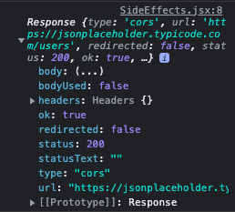
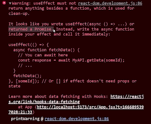
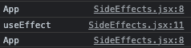

## useEffect

useEffect: The Effect Hook allows you to perform side effects on functional components.

By using this Hook, we are telling React that the component has to do something after rendering.

React will remember the function we have passed it (we will refer to it as our "effect"), and will call it later after updating the DOM.

Does useEffect run after every render? Yes! By default it runs after the first render and after every update.

```jsx
import { useEffect, useState } from "react";

const App = () => {
  const [count, setCount] = useState(0);

  useEffect(() => {
    console.log("App mounted");
  });

  return (
    <>
      <h1>useEffect {count}</h1>
      <button onClick={() => setCount(count + 1)}>Increment</button>
    </>
  );
};

export default App;
```

## Why do I see two logs?

If you see that your logs are repeated, it is because strict mode is enabled in React. In production you should not see it.

```jsx
ReactDOM.createRoot(document.getElementById("root")).render(
  <React.StrictMode>
    <App />
  </React.StrictMode>
);
```

> How can we make useEffect run only once? We pass an empty array as the second argument.

```jsx
useEffect(() => {
  console.log("App mounted");
}, []);
```

## fetch

One of the most important functions of useEffect is to make API requests.

```jsx
import { useEffect, useState } from "react";

const App = () => {
  const [data, setData] = useState([]);

  useEffect(() => {
    console.log("useEffect");
    fetch("https://jsonplaceholder.typicode.com/users")
      .then((response) => response.json())
      .then((data) => setData(data));
  }, []);

  return (
    <>
      <h1>useEffect</h1>
      <ul>
        {data.map((user) => (
          <li key={user.id}>{user.name}</li>
        ))}
      </ul>
    </>
  );
};

export default App;
```

Remember that async takes a back seat.

```jsx
useEffect(() => {
  console.log("useEffect");
  fetch("https://jsonplaceholder.typicode.com/users")
    .then((response) => response.json())
    .then((data) => setData(data));
}, []);
```

JavaScript continue reading our code, it is important that you inistialize useState with empty array.

```jsx
const [data, setData] = useState([]);
```

after we have the data, in this case the users, now if it has information it will be rendered again

```jsx
return (
  <>
    <h1>useEffect</h1>
    <ul>
      {data.map((user) => (
        <li key={user.id}>{user.name}</li>
      ))}
    </ul>
  </>
);
```

> response ok



## async await

We can also use async await to make requests to an API. But for that we need an async function.

```jsx
useEffect(async () => {
  const response = await fetch("https://jsonplaceholder.typicode.com/users");

  const data = await response.json();
  setData(data);
}, []);
```

The problem:



if this return a promise isn't part of the correct use about useEffect

> as a rule we already know that we can not pass async to it

It looks like you wrote useEffect(async () => ...) or returned a Promise. Instead, write the asynchronous function inside your effect and call it immediately.

useEffect should return a cleanup function or nothing.

The problem here is that the first argument of useEffect is supposed to be a function that returns nothing (undefined) or a function (to clean up side effects). But an asynchronous function returns a Promise, which cannot be called as a function! It is simply not what the useEffect expects for its first argument.

```jsx
import { useEffect, useState } from "react";

const App = () => {
  const [user, setUser] = useState([]);

  console.log("App");

  useEffect(() => {
    console.log("useEffect");
    fetch("https://jsonplaceholder.typicode.com/users")
      .then((response) => response.json())
      .then((data) => setUser(data));
  }, []);

  if (user === null) return <div>Cargando...</div>;
  return (
    <>
      <h1>useEffect</h1>
      <ul>
        {data.map((user) => (
          <li key={user.id}>{user.name}</li>
        ))}
      </ul>
    </>
  );
};

export default App;
```

All functions are escaped and do not reach this part of the code.
rerun everything and the ul appeared.

the counter was null, was created, entered the useEffect, continued with our code, because useEffect does not wait for anyone, performed the conditional and exited.

Perfect we finished, the useEffect was executed. I paint effectively the console, setUser changed and read all this information again, obviously did not enter the if but the UI where the list of item was read.

```jsx
return (
  <>
    <h1>useEffect</h1>
    <ul>
      {data.map((user) => (
        <li key={user.id}>{user.name}</li>
      ))}
    </ul>
  </>
);
```



## async await in useEffect

### solution

```jsx
import { useEffect, useState } from "react";

const App = () => {
  const [data, setData] = useState([]);

  useEffect(() => {
    const fetchData = async () => {
      try {
        const response = await fetch(
          "https://jsonplaceholder.typicode.com/users"
        );
        if (!response.ok) {
          throw "Error al conectar la API";
        }
        const data = await response.json();
        setData(data);
      } catch (error) {
        console.log(error);
        setData([]);
      }
    };
    fetchData();
  }, []);

  return (
    <>
      <h1>useEffect</h1>
      <ul>
        {data.map((user) => (
          <li key={user.id}>{user.name}</li>
        ))}
      </ul>
    </>
  );
};

export default App;
```

## Extract function

```jsx
import { useEffect, useState } from "react";

const App = () => {
  const [data, setData] = useState([]);

  const fetchData = async () => {
    console.log("fetchData");
    try {
      const response = await fetch(
        "https://jsonplaceholder.typicode.com/users"
      );
      if (!response.ok) {
        throw "Error al conectar la API";
      }
      const data = await response.json();
      setData(data);
    } catch (error) {
      console.log(error);
      setData([]);
    }
  };

  useEffect(() => {
    fetchData();
  }, []);

  return (
    <>
      <h1>useEffect</h1>
      <ul>
        {data.map((user) => (
          <li key={user.id}>{user.name}</li>
        ))}
      </ul>
    </>
  );
};

export default App;
```

# warning

> Every time the component is rendered the fetchData function will be created. If we don't want it to be created every time, we can use useCallback

## useCallback

```jsx

```
