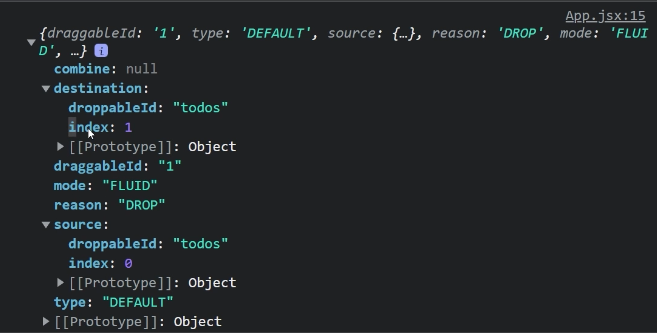
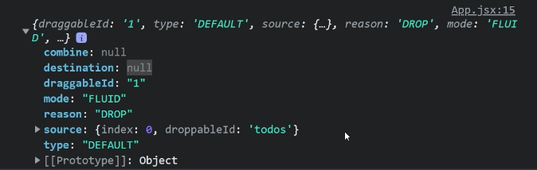

# Todo vite + Tailwind

## Instalation

Vite

```bash
npm create vite@latest
```

Tailwind CSS

```bash
npm install -D tailwindcss postcss autoprefixer
npx tailwindcss init -p
tailwind.config.cjs
```

```bash
/** @type {import('tailwindcss').Config} */
module.exports = {
    content: ["./index.html", "./src/**/*.{js,ts,jsx,tsx,vue}"],
    theme: {
        extend: {},
    },
    plugins: [],
};
```

```css
@tailwind base;
@tailwind components;
@tailwind utilities;
```

## resource

[tailwind-cheat-sheet](https://tailwindcomponents.com/cheatsheet/)

## Todo star project

let´s working first one with mobile first

## Tailwind + React

this form we can pass a selector

```html
<div className="rounded-md bg-white [&>article]:p-4"></div>
```

in this component we have destructuring, rest operator, and spread operator

```jsx
import React from "react";

const Moon = ({ fill = "#fff", ...props }) => (
  <svg xmlns="http://www.w3.org/2000/svg" width="26" height="26">
    <path
      {...props}
      fill={fill}
      fillRule="evenodd"
      d="M13 0c.81 0 1.603.074 2.373.216C10.593 1.199 7 5.43 7 10.5 7 16.299 11.701 21 17.5 21c2.996 0 5.7-1.255 7.613-3.268C23.22 22.572 18.51 26 13 26 5.82 26 0 20.18 0 13S5.82 0 13 0z"
    />
  </svg>
);

export default Moon;
```

component:

```jsx
<Moon fill="#fff" />
```

## Update and Delete

```jsx
import React, { useState } from "react";

import Header from "./components/Header";
import TodoCreate from "./components/TodoCreate";
import Todolist from "./components/Todolist";
import TodoComputed from "./components/TodoComputed";
import TodoFilter from "./components/TodoFilter";

const initialStateTodos = [
  {
    id: 1,
    title: "Go to the gym",
    completed: true,
  },
  {
    id: 2,
    title: "Complete the online english course",
    completed: false,
  },
  {
    id: 3,
    title: "Go to the supermarket",
    completed: false,
  },

  {
    id: 4,
    title: "Pick up Groceries",
    completed: true,
  },

  {
    id: 5,
    title: "Complete Web App on frontend mentor",
    completed: false,
  },
];

const App = () => {
  const [todos, setTodos] = useState(initialStateTodos);

  function generateID() {
    return Math.random().toString(36).slice(2);
  }

  const createTodo = (title) => {
    const newTodo = {
      id: Date.now(),
      title,
      completed: false,
    };

    setTodos([...todos, newTodo]);
  };

  const updateTodo = (id) => {
    setTodos(
      todos.map((todo) =>
        todo.id === id ? { ...todo, completed: !todo.completed } : todo
      )
    );
  }; //change the state of complete with ! in this case use spread sintax

  const removeTodo = (id) => {
    setTodos(todos.filter((todo) => todo.id !== id));
  }; // If the function returns true, the element is included in the new array; if it returns false, the element is excluded

  return (
    <div className="min-h-screen bg-gray-200 bg-[url('./assets/images/bg-mobile-light.jpg')] bg-contain bg-no-repeat">
      <Header />
      <main className="container mx-auto mt-8 px-4">
        <TodoCreate createTodo={createTodo} />

        <Todolist
          todos={todos}
          updateTodo={updateTodo}
          removeTodo={removeTodo}
        />

        <TodoComputed />
        {/* Todo Filter */}
        <TodoFilter />
        <footer className="mt-8 text-center">Drag and Drop</footer>
      </main>
    </div>
  );
};

export default App;
```

In the code you provided, {...todo} is a spread syntax. It creates a new object and spreads all the properties of the todo object into it. This is commonly used in React to create a new object with updated properties while preserving the original object's properties.

In the updateTodo function, the spread syntax is used to create a new object for each todo item in the todos array. The map method is used to iterate over each todo item and create a new array with the updated todo items.

In the map method, a ternary operator is used to check if the id of the current todo item matches the id passed to the updateTodo function. If the id matches, a new object is created using the spread syntax, with the completed property set to the opposite of its current value. This effectively toggles the completed property of the matched todo item.

If the id does not match, the original todo object is returned unchanged. This ensures that only the matched todo item is updated, and the rest of the todos array is preserved.

Finally, the updated array of todos is passed to the setTodos function, which updates the state of the component and causes it to re-render with the updated list of todos.

## Header Dark Mode

Each time that we want to execute a code that is pending of some state, we can use useEffect, also, we can execute rendering for the first time

## useRef

In this case, we are access to the element that controls react

```jsx
import React, { useEffect, useState } from "react";
import IconMoon from "./icons/IconMoon";
import IconSun from "./icons/IconSun";

const Header = () => {
  const [darkMode, setdarkMode] = useState(true);
  const refHeader = useRef(null);
  useEffect(() => {
    console.log("darkmode");
    if (darkMode) {
      refHeader.current.classList.add("dark");
      localStorage.theme = "dark";
    } else {
      refHeader.current.classList.remove("dark");
      localStorage.theme = "light";
    }
  }, [darkMode]);

  return (
    <header className="container mx-auto px-4 pt-8" ref={refHeader}>
      <div className="flex justify-between">
        <h1 className="text-2xl uppercase tracking-[0.3em] text-white">Todo</h1>
        <button onClick={() => setdarkMode(!darkMode)}>
          {darkMode ? <IconSun /> : <IconMoon />}
        </button>
      </div>
    </header>
  );
};

export default Header;
```

but not is controls by react we don't need a reference

## Drag and Drop React

### React hello-pangea/dnd

is a library that allows us to use drag and drop interfaces in React. It is designed to be lightweight, fast and easy to use.

### yarn

yarn add @hello-pangea/dnd --save

```jsx
import { DragDropContext, Droppable, Draggable } from "@hello-pangea/dnd";
```

**DragDropContext** will give our application the ability to use the library. It works similar to React's context API, where the library can now have access to the component tree.

**Droppable** is a component that lets the library know where elements can be dropped. It is like a container that can hold elements that can be dropped.

**Draggable** is a component that lets the library know which elements can be dragged.

### Droppable

We want to create a Droppable area, which means that this will allow us to provide a specific area where our items can be moved within.

droppableId: It is a unique identifier used to identify this specific Droppable instance.
droppableProvider: Allows us to access the library's status information.
droppableProvider.innerRef: This will create a reference ( provided.innerRef) for the library to access the HTML element of the list item.
droppableProvider.droppableProps: [API reference](https://github.com/hello-pangea/dnd/blob/main/docs/api/droppable.md)

The idea is envelop all our app with **DragDropContext**

**Droppable** this element can be dropped inside of <ul></ul>

```jsx
import React from "react";
import { Droppable } from "@hello-pangea/dnd";
import TodoItem from "./TodoItem";

const Todolist = ({ todos, removeTodo, updateTodo }) => {
  return (
    <ul className="overflow-hidden rounded-t-md bg-white transition-all duration-700 [&>article]:p-4">
      <Droppable droppableId="todos">
        {todos.map((todo) => (
          <TodoItem
            key={todo.id}
            todo={todo}
            updateTodo={updateTodo}
            removeTodo={removeTodo}
          />
        ))}
      </Droppable>
    </ul>
  );
};

export default Todolist;
```

```bash
dnd.esm.js:7915 Uncaught TypeError: children is not a function
    at Droppable (dnd.esm.js:7915:6)
    at renderWithHooks
```

We have an issue with resolving this problem, we can return a function, then we have to access to parameters **droppableProvider**, but the console say requires a droppableId, is a props, and can be a text like a section name.
We need to pass a reference for the library to access the HTML element of the list item. We apply spread operator for passing more props

### Draggable

We will use the Draggable component, which again, similar to the Droppable component, will include a function in which we will pass the attachments to the components of our list item.

key=
draggableId={todo.id} : This is a unique identifier that is used to identify this specific instance of Draggable.
index={index} : This is the index of the list of items being iterated. This is used to determine the order of the items in the list.
jsx

We have the same error, again we must return the function
and pass a string like an id

provided.draggableProps (DraggableProps): This is an Object that contains a data attribute and an inline style. This Object needs to be applied to the same node that you apply provided.innerRef to. This controls the movement of the draggable when it is dragging and not dragging. You are welcome to add your own styles to DraggableProps.style – but please do not remove or replace any of the properties.

provided.dragHandleProps (?DragHandleProps) every <Draggable /> has a drag handle. This is what is used to drag the whole <Draggable />. Often this will be the same node as the <Draggable />, but sometimes it can be a child of the <Draggable />. DragHandleProps need to be applied to the node that you want to be the drag handle. This is a number of props that need to be applied to the <Draggable /> node. The simplest approach is to spread the props onto the draggable node ({...provided.dragHandleProps}). However, you are also welcome to monkey patch these props if you also need to respond to them. DragHandleProps will be null when isDragDisabled is set to true.

Persist the order of the elements#.
To solve this, DragDropContext takes an onDragEnd props that will allow us to trigger a function after the drag has completed.

splice js: The splice() method changes the contents of an array by removing existing elements and/or adding new elements.

```js
array.splice(start[, deleteCount[, item1[, item2[, ...]]]])
```

start: Index where the array will start to be changed.

deleteCount: Number of elements (integers) to delete, starting with start.
If it is 1, one element will be deleted.
If 0, no elements will be deleted. In this case, at least one new element must be specified.

item1, item2, ....: The items to be added to the array. If not specified, splice() will only remove elements from the array.

Let´s go a go over that show us the console



The source said us from start 0 we pass to position 1, destination show us the actual position. if some user drag out the container, the console show us destination null



## validation destination

```jsx
const handleDragEnd = (result) => {
    // console.log(result);
    if (!result.destination) return;

    console.log("origen: ", result.source.index);
    console.log("fin: ", result.destination.index);

    const startIndex = result.source.index;
    const endIndex = result.destination.index;

    const items = [...todos];
    // con splice estamos eliminando un elemento del array y devolviendo ese elemento
    const [reorderedItem] = items.splice(startIndex, 1);

    // con splice estamos insertando un elemento en el array
    items.splice(endIndex, 0, reorderedItem);

    setTodos(items);
};

return (
    <DragDropContext onDragEnd={handleDragEnd}>
    ...
```

### Refactoring

```jsx
const reorder = (list, startIndex, endIndex) => {
    const result = [...list];
    const [removed] = result.splice(startIndex, 1);
    result.splice(endIndex, 0, removed);

    return result;
};

const App = () => {
    const [todos, setTodos] = useState(initialTodos);

    const handleDragEnd = (result) => {
        const { destination, source } = result;
        if (!destination) return;
        if (
            source.index === destination.index &&
            source.droppableId === destination.droppableId
        )
            return;

        setTodos((prevTasks) =>
            reorder(prevTasks, source.index, destination.index)
        );
    };
```

- 1 step is delete
  the method splice modifies the original array, not create a copy

We have a issue

```jsx
<TodoItem
  ref={provided.innerRef}
  {...provided.dragHandleProps}
  {...provided.draggableProps}
  todo={todo}
  updateTodo={updateTodo}
  removeTodo={removeTodo}
/>
```

it does not happen magically, that reference of the virtual DOM that we are creating, every time we have a component that we invented we cannot pass a ref to it because React does not manage to understand it at all.

To resolve this we need React.forward

```jsx
import React from "react";
import IconCheck from "./icons/IconCheck";
import IconCross from "./icons/IconCross";

const TodoItem = React.forwardRef(
  ({ todo, updateTodo, removeTodo, ...props }, ref) => {
    const { id, title, completed } = todo;
    return (
      <li
        {...props}
        ref={ref}
        className="flex gap-4 border-b px-4 py-4  dark:bg-gray-800"
      >
        <button
          className={`h-5 w-5 flex-none rounded-full border-2 ${
            completed
              ? "grid place-items-center bg-gradient-to-r from-indigo-500 via-purple-500 to-pink-500"
              : "inline-block"
          } `}
          onClick={() => updateTodo(id)}
        >
          {completed && <IconCheck />}
        </button>
        <p
          className={`grow text-gray-600  transition-all duration-700 dark:text-gray-400 ${
            completed && "line-through"
          }`}
        >
          {title}
        </p>
        <button onClick={() => removeTodo(id)}>
          <IconCross />
        </button>
      </li>
    );
  }
);

export default TodoItem;
```

**you have to make this configuration so that the main component can access the nested component**

[forwardRef](https://react.dev/reference/react/forwardRef)

## Reference

### forwardRef(render)

Call forwardRef() to let your component receive a ref and forward it to a child component:

```jsx
import { forwardRef } from "react";

const MyInput = forwardRef(function MyInput(props, ref) {
  // ...
});
```

Parameters

render: The render function for your component. React calls this function with the props and ref that your component received from its parent. The JSX you return will be the output of your component.
Returns

forwardRef returns a React component that you can render in JSX. Unlike React components defined as plain functions, a component returned by forwardRef is also able to receive a ref prop.

```jsx
//old implementation

const handleDragEnd = (result) => {
  if (!result.destination) return;

  const startIndex = result.source.index;
  const endIndex = result.destination.index;

  const copyItems = [...todos];
  // with splice we are removing an element from the array and returning that element
  const [reorderedItem] = items.splice(startIndex, 1);

  // with splice we embedded an element in the array
  copyItems.splice(endIndex, 0, reorderedItem);

  setTodos(copyItems);
};
```
